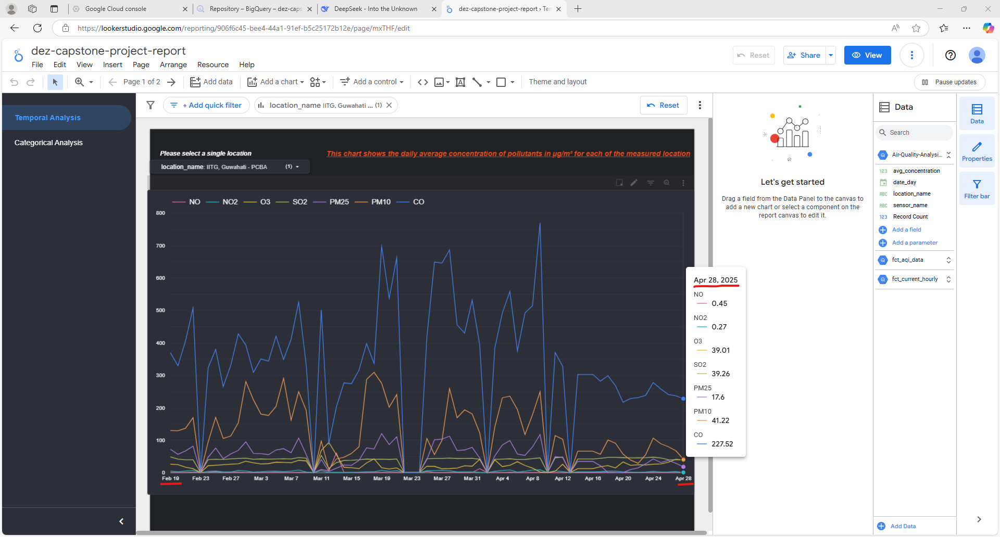
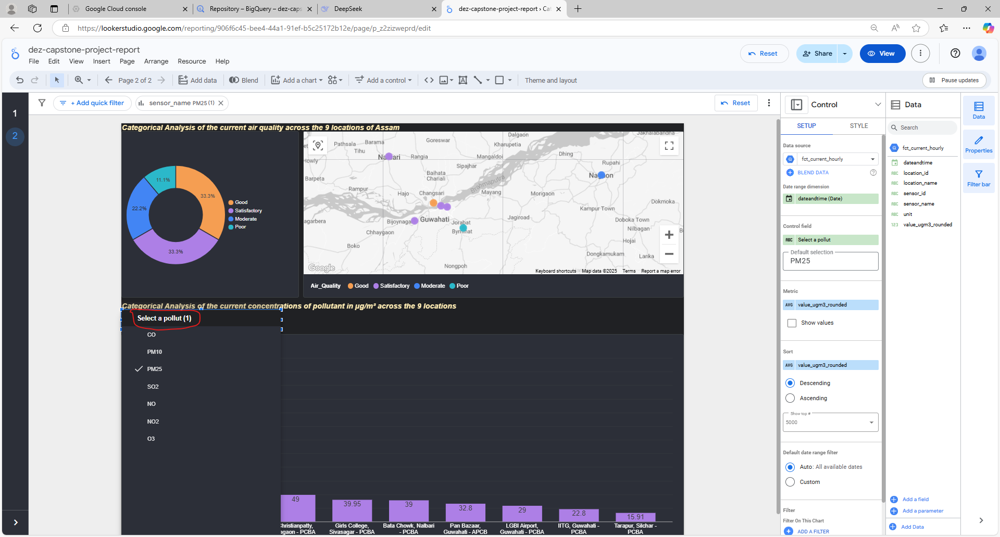

# Air Quality Analysis Data Pipeline #

## 🟠 Problem Description ##

 The northeastern Indian state of Assam has witnessed a significant deterioration in air quality over the past few years. This concerning trend is primarily driven by a combination of factors:

 - Large-scale deforestation, resulting from rapid urban expansion.

 - A surge in vehicular traffic, especially in key urban centers.

 - Massive construction activities, both governmental and private, that release dust and pollutants into the air.

 Although the Central Pollution Control Board (CPCB) has installed air quality sensors in 9 locations across Assam as of February 2025 (with 3 older sensors repaired and expanded since then), the state currently lacks a centralized and automated system to:

 - Collect real-time air quality data.

 - Analyze pollution patterns.

 - Visualize historical and current trends.

 - Provide actionable insights for policymakers, researchers, and the public.

 The absence of such an end-to-end data infrastructure means that critical air quality insights remain buried in raw sensor feeds or siloed reports, inaccessible to most stakeholders.

## 🟢 Solution Overview ##

To address this gap, I designed and implemented a state-specific, smart air quality monitoring pipeline for Assam that provides an automated, scalable, and intelligent solution. Key components include:

 ### 🔹1. Data Extraction ###

  Automated data fetching from CPCB sensor across the 9 stations in Assam routed through [__OpenAQ__](https://openaq.org/). I have used 3 APIs from OpenAQ: 

  - one for the historical data fetch from Feb 2025 (date sensors were installed in the locations). You can have a look [__here__](/orchestration/scripts/historical_readings_ingestion.py)

  - two for the hourly data fetch: one fetches the sensor ids for a particular (concerned) location and the 2nd fetches the sensor (pollutant) values for those sensor ids of that location with latest measured values from the last/previous hour. You can have a look [__here__](/dlt/hourly_readings_ingestion.py)

 ### 🔹2. Data Ingestion ###

   Data fetched from the sources are loaded into a datalake in the form of:

   - hourly data for all pollutants of each location (9 in mmy case) in csv format 
   
   - hsitorical data, it is per day(date) record of all pollutants - location wise compresses csv for all 9 locations. This is supposed to be an one time activity.

 ### 🔹3. Data Load ###

   The data from the datalake for both historical and latest measurements are loaded into a data warehouse through external tables of the warehouse.

 ### 🔹4. Data Transformation ###

   Here the data loaded in the warehoise goes transformation from raw crude bronze level to analytics usable golden level. This transformation is handled through a cloud based (although locally installable version is available ) data transformation tool.

 ### 🔹5. Automation and orchestration ###

   These activities right from data extraction to ingestion to loading to transformation are fully automated and each activity executes in sequential sync with the next in a seamlessly orchestrated way. An orchestration tool handled this right from loading data into datalake, getting and storing it into the datawarehouse and transformaing it to be analytics ready.

 ### 🔹6. Visualization ###

   So fianlly with the cleaned and curated data, became ready for gettign visual insights out of them that reveal trends and patterns not very forthcoming in tabular data. The visualization tool automatically picks up the transformed data in the datawarehouse and visualize them through charts and other analytical widgets. The tool also responds to changes in the data at the warehouse by refreshing the charts and widgets.

## ⚙️🔧 Technical Overview ##

 ### Technology Stack I have used ###

 - Google Cloud Platform as the main cloud platform

 - Google Cloud Storage Bucket as the data lake

 - Google BigQuery as the data warehouse

 - Terraform as Infrastructure as Code (IaC) tool.

 - Kestra as the orchestratool tool

 - dbt Cloud as the cloud based data transformation tool

 - Google Looker Studio ads the visualizaation tool.
 
 - dlt frrom dltHub which is a data loading tool

 - my (this) Github repository

 ### Architecture and interplay of these components for running this ELT data pipeline with batch-processing ###

   

 ### Project Structure ###
        
   
   |                                            |                                            |
   |--------------------------------------------|--------------------------------------------|
   |         |           |

## ☁️ Cloud and Terraform ##

  - After getting my GCP account, I had created the Project and the Serive account for this project. 

  - The from my local machine I used, Terraform as the IaC tool to create resources at the Google Cloud Platform. Apart from mandatory associated firewall rules and API enablement, etc. Terraform created : the compute engine VM, the BigQuery dataset and the GCS bucket.

  - The VM was then set up for the project. The entire project is  developed on that VM. 

  - All details regarding this can be found  👉  [__here__](/docs/PLATFORM-SETUP.md) 

##  🕒 [⚙️]→[⚙️] Workflow Orchestraion and Batch Proceessing  ##

  - End to end batch processed pipeline from data extraction from OpenAQ sources to data transformation in BigQuery with dbt Cloud. The following is a Direct Acyclic Graph (DAG) of the hourly work flow runnig at Kestra.

    

  - All details regarding setting up and operationalization of the orchestration tool Kestra can be found  👉  [__here__](/docs/PROJECT-SETUP-VM-Kestra.md) 

##   Use of Data Warehouse with table partitioning and clustering ## 

  - Google BigQuery is used as the data warehouse for my project

  - Tables with growth to large cardinality and currently with rows more than 10k have been partined and clustered. The scripts for creating tables with partitioning and clustering are to be found in the [dbt models](/dbt/models/core/).`
 

    |                                            |                                            |
    |--------------------------------------------|--------------------------------------------|
    |      |       |

##  Data transformation with dbt ## 

  - I have used dbt Cloud for the trasformation part of the pipeline. dbt Cloud connets to my BigQuery dataset and executes the transformations seamlessly. 

  -  All details regarding setting up and operationalization of the data transformation tool dbt Cloud can be found  👉  [__here__](/docs/PROJECT-SETUP-dbt_Cloud.md) 

  - Further, these dbt Cloud operations (defined in a job) are also integrated with the orchestrration tool which triggers the dbt build after each hourly successfull load of data from the GCS bucket to BigQuery dataset through an external table. The flow can be found [__here__](/orchestration/flows/dez.capstone_hourly_air_quality.yml)

  - At the time of first writing this document, the the API triggered dbt build started off successfully at the Production environment at dbt Cloud and consequent BigQuery dataset data also transformed successfully. Till now (from 21st April 2025 till the time of updating this document), the API triggered build has been going on flawlessly.

   
   |                                                |                                                                |
   |------------------------------------------------|----------------------------------------------------------------|
   |     |            |

  - The succesfully generated documentation featured as the Lineage show the DAG pertaining to the data transformation with dbt.

         

##  📈 Analytics Dashboard ##

 ### 🔆 Plan for the analytics dashboard in view the fact table models created ###

   ⤴️ fct_current_hourly ➔➔➔ Concentration value of all pollutants [PM10, PM2.5, 03, NO2, NO, SO2, CO] currently at the selected location (9 locations)

   ⤴️ fct_aqi_data ➔➔➔ Pie chart categorisation of air quality [Good, Satisfacatory, Moderate, Poor, Very Poor, Severe] among the 9 locations

   ⤴️ fct_temporal_locationwise ➔➔➔  Daily average of each pollutant from a selected location across a timeline from Feb 2025 (installation date of the sensors)

 ### 🚀 According to the aforementioned plan, the dashboard, namely _dez-capstone-project-report_ has been created with 2 pages/sections:  ###

   #### 📆🡆📊 Temporal Analysis

   |                                                     |                                                         |
   |-----------------------------------------------------|---------------------------------------------------------|
   |     |  |

   #### 🔠🡆📊 Categorical Analysis
 

   |                                                       |                                                           |
   |-------------------------------------------------------|-----------------------------------------------------------|
   |     |  |

 ### 🔗  __The online dashboard can be acccesed [__here__](https://lookerstudio.google.com/reporting/906f6c45-bee4-44a1-91ef-b5c25172b12e/page/mxTHF)__ [will be live till 10th May 2025]

 ### 📋🖼️ The captured images of the views of the Analytical Reports can be found [__here__](/docs/Analytical-Reports-public-view.md)

