## GCP Platform Set-up ##

 1. At first, Google Cloud Platform (GCP) account needs to be created.

 2. From the Project Selector in your GCP account, you shall get the Create Projct button which you need to click.

  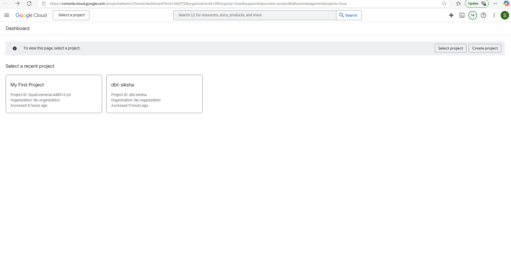

 3. You shall land in the Project Creation Page where you need to input a Project Name and create the project. I put  __dez-capstone-project1__ as the project name.

  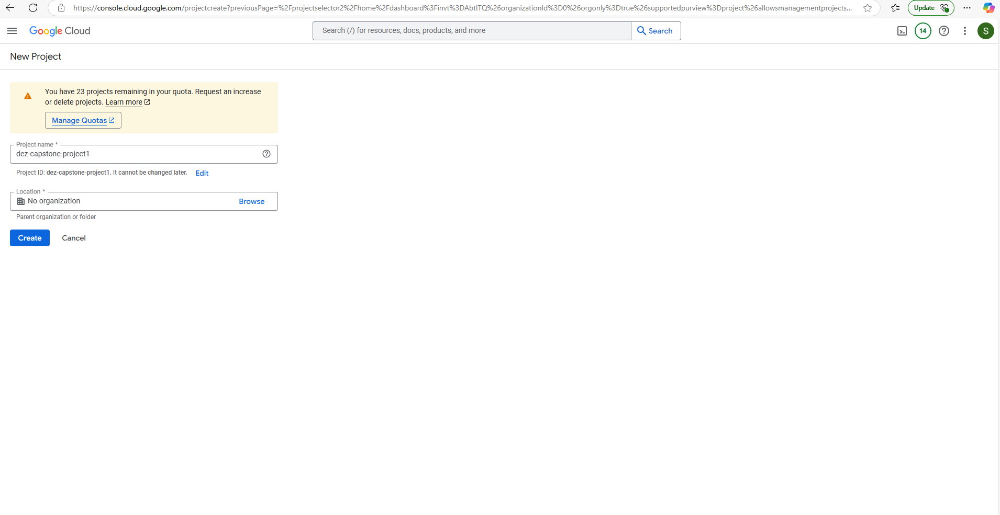

 4. After the project is created, you shall land in the Dashboard for that project.

  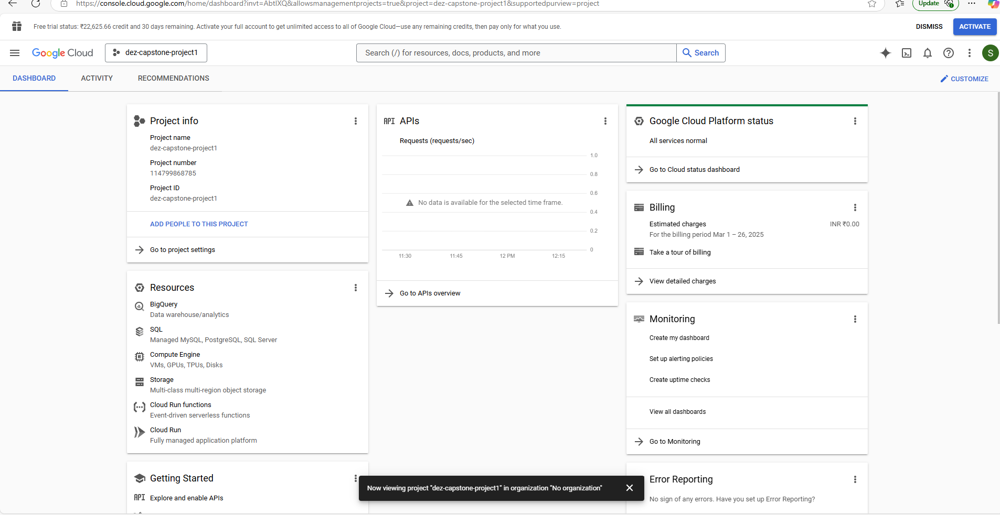

 5. Now proceed to create a service account under this project. From the side menu, go to __IAM & Admin__ --> __Service Accounts__ --> __Create Service Account__.

  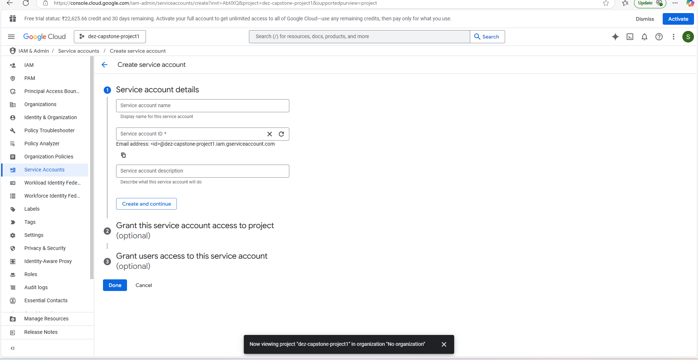

 6. I had put __capstone-project1-service-account__ as the Service account name and __cap-proj1-svc-acct__ as the Service account ID. Subsequently, we need to grant the following roles to it:
 -  BigQuery Admin			
 -  BigQuery Data Editor
 -  BigQuery Data Owner
 -  BigQuery Job User
 -  BigQuery User
 -  Compute Admin
 -  Service Usage Admin
 -  Storage Admin
 -  Storage Object Admin

  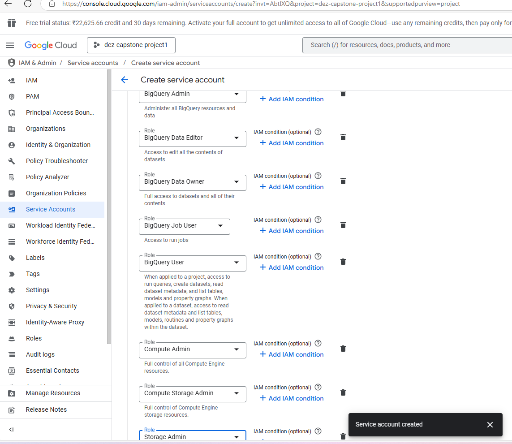

  7. After creation of the service account with the required roles, we need to generate the service account keys which __dbt__ and __Terraform__ shall use for integration with __BigQuery__ and  __GCS Bucket__ Under the listed service account go to __Actions__ and select __Manage keys__ from there.

  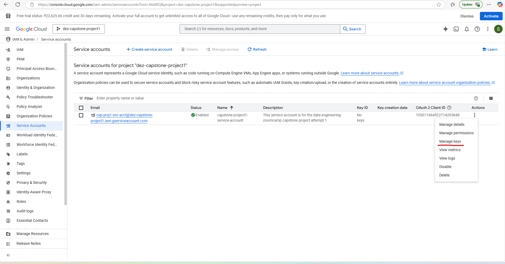

   In the page that comes up, select __Create new key__ from the __Add key__ dropdown. Select the option for __JSON__ and click on __Create__ The private key in JSON format will be generated and downloaded to your local machine. 
    
   |                                            |                                           |
   |--------------------------------------------|-------------------------------------------|
   |  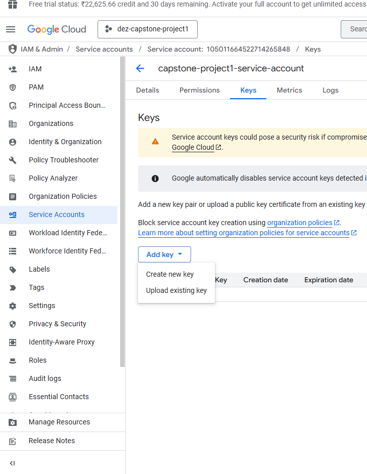  | 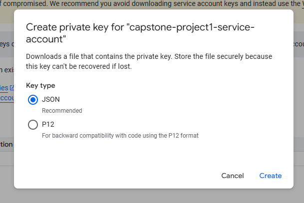  |

   
  8. Finally, go to  APIs & Services--->API Library. There on the search box search for __Cloud Resource Manager API__ and go to that page and enable the API

   |                                            |                                            |
   |------------------------------------------- | ------------------------------------------ |
   |  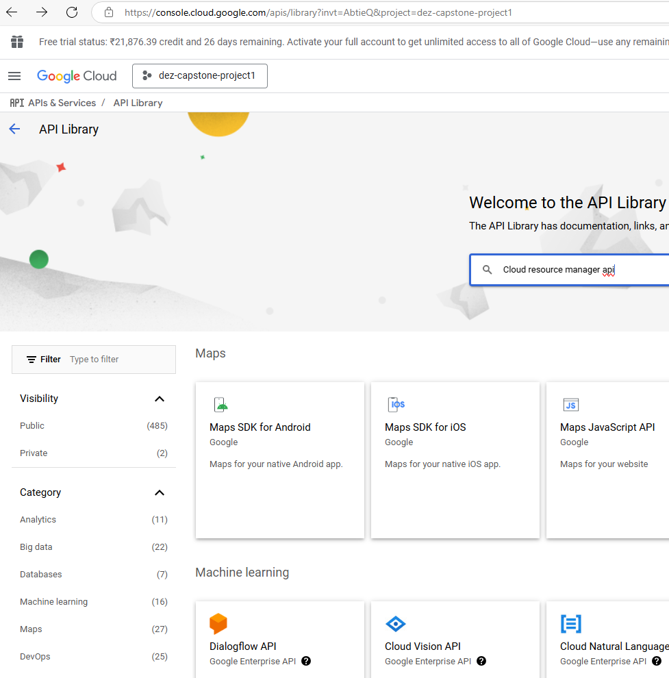 | 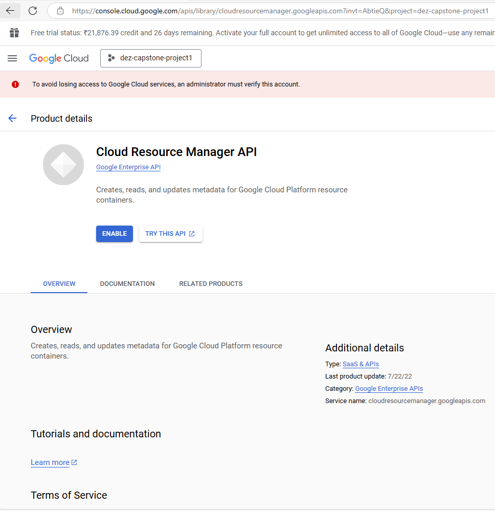  |

## Terraform Set-up at Local Machine and its Operation on your Google Cloud Platform ##

 1. Please [install Terraform](https://developer.hashicorp.com/terraform/install?ajs_aid=268d2cbe-21f8-4c6c-9588-849c28f1444b&product_intent=terraform#linux) under the WSL in your local machine.

 2. Clone my project from my Github repository.

        git clone https://github.com/SapientSapiens/capstoneproject-2025-dez.git

 3. For simplicity and better organization in the project structure, the directory named __.secrets__ under the project directory had been created. Place your just downloaded json file there and rename it to _my-creds.json_ 

 4. Before running Terraform commands in the _main.tf_, we need to be clear what it shall achieve. It will:
  - Enable the Compute Engine API for Compute Engines under current project
  - The public key (gcp.pub in my case) of the ssh keys generated in the local machine (from where you shall connect to the VM created under this project) under the ~/.shh directory (generated with __ssh-keygen__), shall be added to the Metadata at Compute Engine under this project. 
  - Create the VM server namely __dez-capstone-project-vm__
  - Create a Firewall rule for the VPC under the Project required for running Kestra from cloud (from inside the VM to be created above).
  - Create a Google Cloud Storage Bucket under this project
  - Create a BigQuery dataset/schema under this project

 5. For simplicity of relative filepath for Terraform, copy this public key from the __~/.shh__ directory to the __.secrets__ directory under this project directory.

 6. Accordingly, the [__main.tf__](../terraform/main.tf) and [__variables.tf__ ](../terraform/variables.tf) needs to be scripted.

 7. Then go inside the terraform directory and initialize terraform
 
        cd terraform
        
        terraform init 
   

   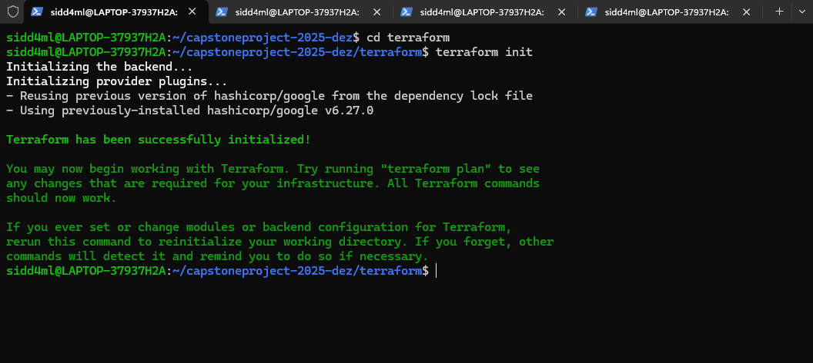

 8. After successfull initialization, with __terraform plan__ you can preview a report of what actions Terraform will take when you run __terraform apply__ . Also if any issues are there in your __main.tf__ or __variables.tf__ that can cause error, terraform plan shall let you know beforehand. You can also save this plan with 

        terraform plan -out=tfplan
  
   |                                            |                                            |
   |--------------------------------------------|--------------------------------------------|
   | 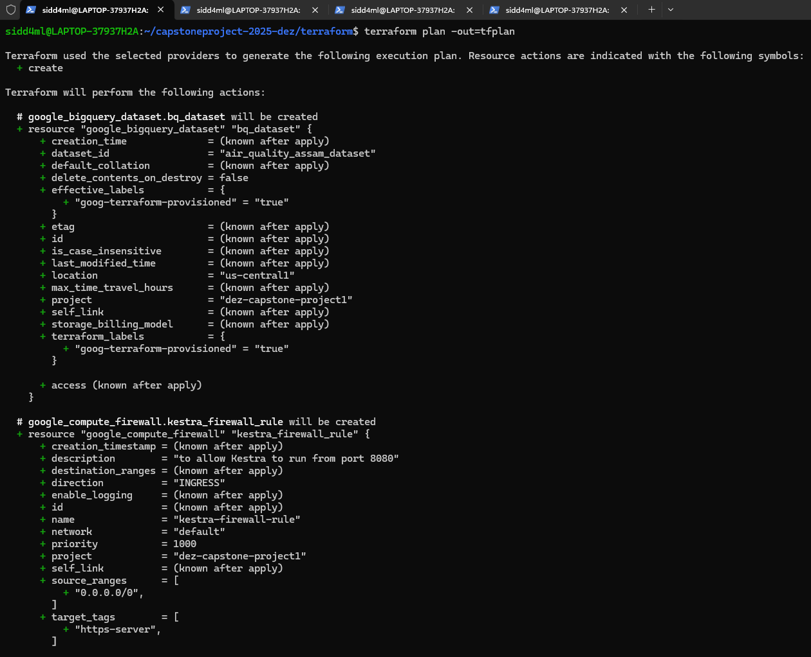   | 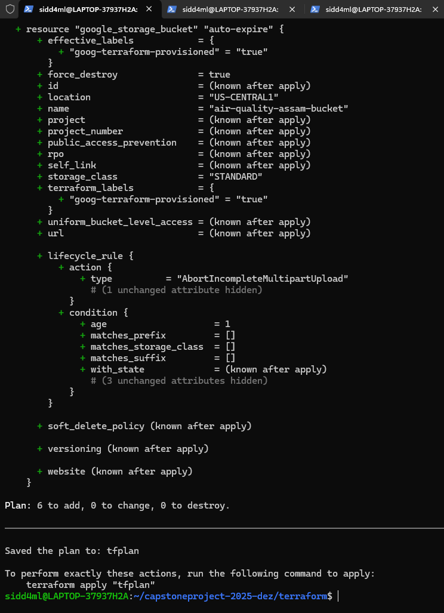  |

 9. Since the plan for the infrastructure with Terrafoem is already reviewed and saved to tfplan, we can run

        terraform apply tfplan

 10. Terraform successfully carries out the plan.

   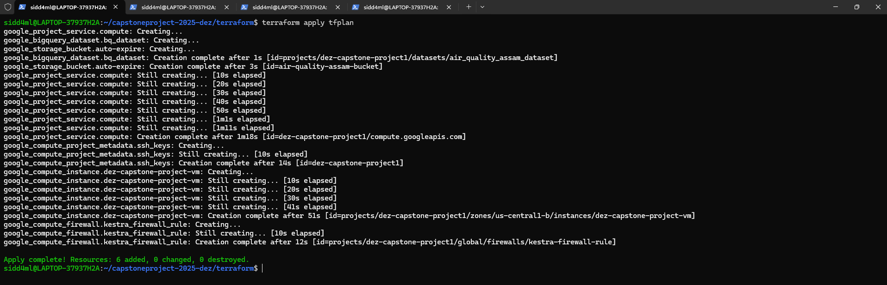

 11. Now let us check the created resources
  
   |                                            |                                            |
   |--------------------------------------------|--------------------------------------------|
   | 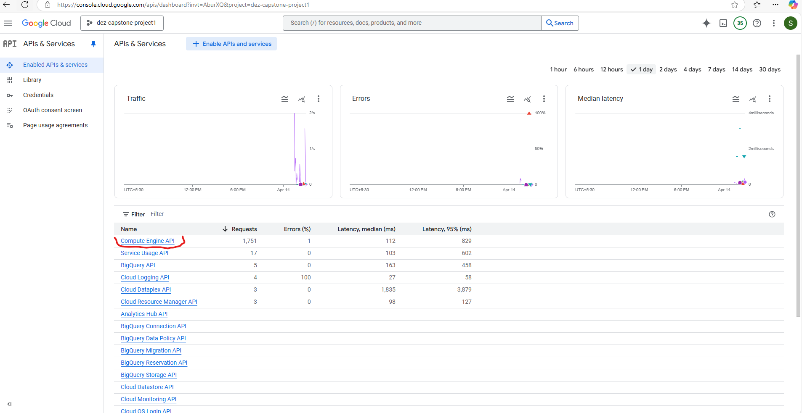  | 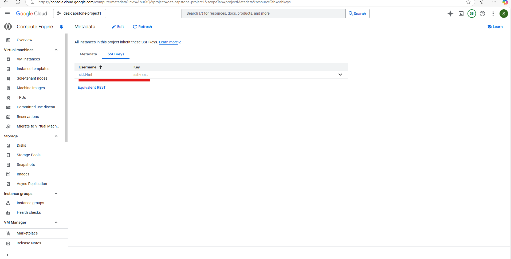  |

   |                                            |                                            |
   |--------------------------------------------|--------------------------------------------|
   | 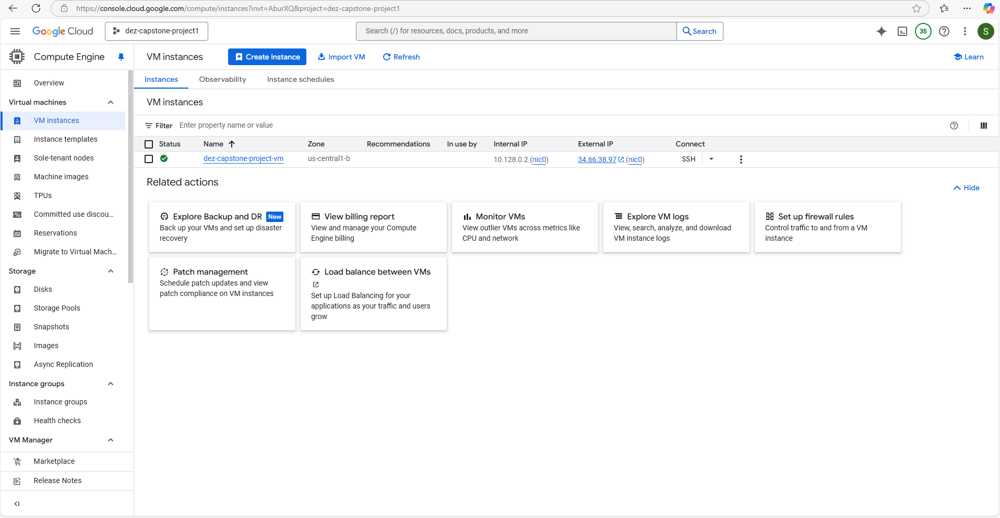  | 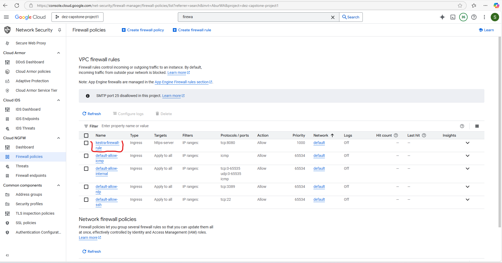  |

   |                                         |                                               |
   |-----------------------------------------|-----------------------------------------------|
   | 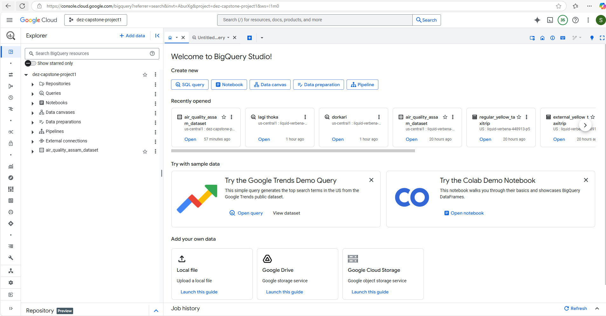  | 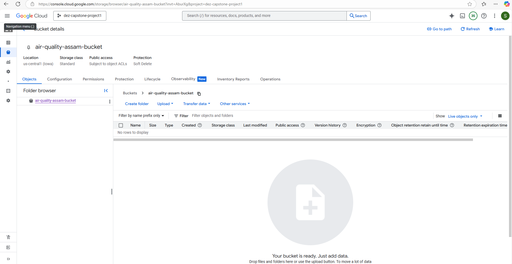  |

## Readying the VM created with Terraform for use in the Project ##

 1. First you need to connect and control this VM from the machine (_maybe your local machine or another VM in cloud_) where you had created the keys (_with the ssh-keygen tool_) that you had input to the Compute Engine Metadata through Terraform.

 2. So in your local machine create a file named _config_ in the same directory your generated the ssh keys (__~/.shh__). Contents of my config file are:

        Host dez-capstone-project-vm
            HostName 34.66.38.97
            User sidd4ml
            IdentityFile ~/.ssh/gcp

    Note:  The IP of the VM is ephemeral; it is renewed for every restart of the VM.

  3. With these set, you can now connect to the project VM from your WSL terminal. And even access your project folder inside the VM with VSCode (just need to install the Remote - SSH extension in VSCode) so that you can directly develop and run your project in that VM.

         ssh dez-capstone-project-vm
        
   |                                            |                                            |                                           |
   |--------------------------------------------|--------------------------------------------|-------------------------------------------|
   | 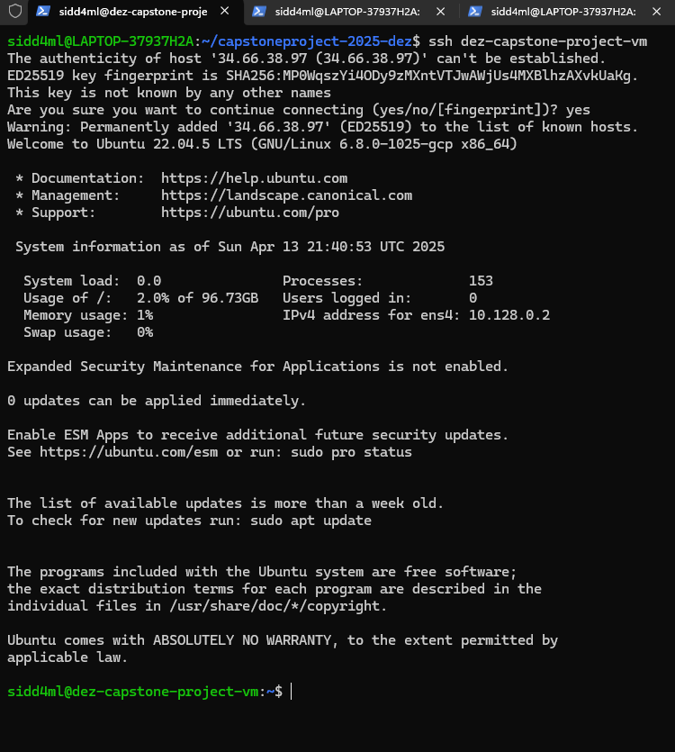  | 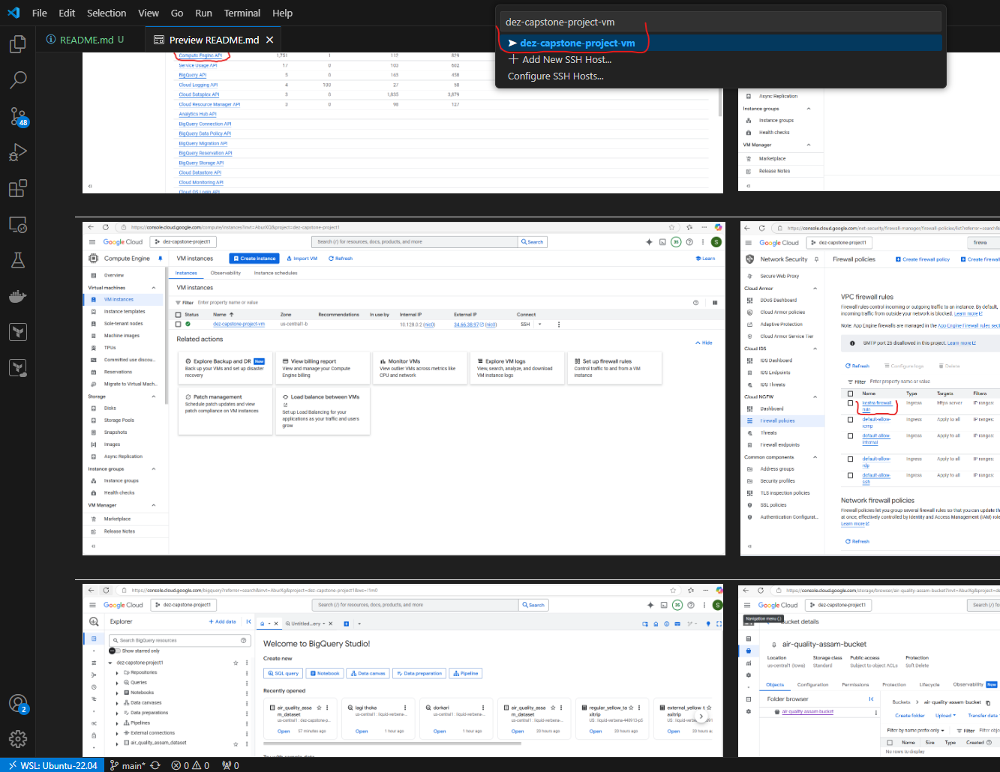  | 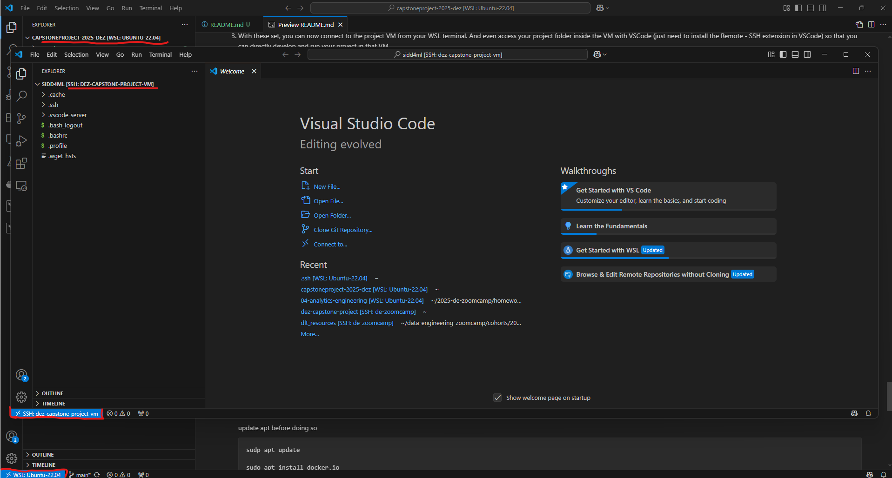 |

  
   4. Now you need to set up the environment and configuration of the VM. Start with :

  - Installing annaconda 

         wget https://repo.anaconda.com/archive/Anaconda3-2024.10-1-Linux-x86_64.sh

         bash Anaconda3-2024.10-1-Linux-x86_64.sh
  
     logout and re-login into the VM to get the conda base prompt.

  -  Install docker

      update apt before doing so

         sudo apt update   
       
         sudo apt install docker.io

         sudo gpasswd -a $USER docker

         sudo service docker restart

     logot and re-login into the VM to this take effect

  -  Install docker-compose

     create a directory __bin__ in the home directory of the VM and get inside the same

         mkdir bin

         cd bin

     download docker-compose and make it executable

         wget https://github.com/docker/compose/releases/download/v2.34.0/docker-compose-linux-x86_64 -O docker-compose
      
         chmod +x docker-compose

     return to home directory and add the path to the __bin__ directory to the PATH variable in .bashrc

          cd ~

          nano .bashrc

          export PATH="${HOME}/bin:${PATH}"  # add this line at the end of the .bashrc file. Save and exit the nano editor.

          source .bashrc

## There is a [video by our coach Alexey](https://youtu.be/ae-CV2KfoN0?si=uSpBat_dUobrSR5r) which can also be very helpful in carrying out the tasks defined in this document till now. ##

  
     
   
     
